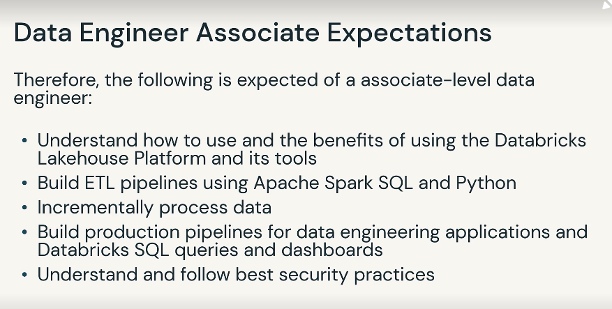

# Certification Overview: Databricks Certified Data Engineer Associate V2 Exam

Exam expectations

Certification Exam topics

- Databricks Lakehouse Platform (24%)
    
    
    
    Understand the following
    
    - Lakehouse Concepts
        - Lakehouse vs warehouse
        - Lakehouse vs lake
        - Data Quality improvements
    - Platform Architecture
        - High level architecture and key components of workspace deployment
        - Core services in databricks workspace
    - Benefits to data team
        - Org data problems solved with data lakehouse
        - Benefits to different roles in data teams
- Data Science and Engineering workspace
    
    
    
- Delta Lake
    
    
    
- ELT with Spark SQL and Python (29%)
    
    
    
    
    
    ELT Pt1: Creating and writing tables
    
    
    
    ELT Pt2: Creating and writing tables
    
    
    
    - use pyspark to leverage advanced code functionality
    
    
    
- Incremental Data Processing (22%)
    
    Delta Live Tables
    
    Streaming
    
    
    
- Production Pipelines (16%)
    
    
    
- Data Governance(9%)
    
    