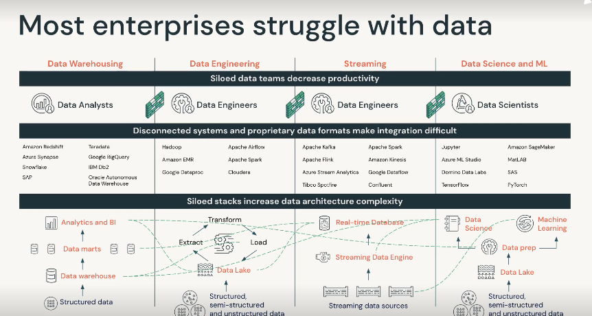

# Data Engineering with Databricks V2

[Loading](https://customer-academy.databricks.com/learn/course/internal/view/elearning/62/data-engineering-with-databricks-v2)

Tutorial material

https://github.com/databricks-academy/data-engineering-with-databricks-english/releases/tag/v2.2.2

- **[00] Databricks Lakehouse Platform**
    - Challenges most organizations have with data start with architecture-
    - There are like 4 different stacks for Data Warehousing, Data Engineering, Streaming, ML and DS
    - This requires to maintain 4 different stacks of tech, there are many different tools for each stack which don’t work well with each other, all of it becomes expensive to manage
        
        
        
    - Lakehouse - to unify everything
    - Delta lake is the tech behind data lakehouse. Provides all features of data warehouse in data lake object storage
    - Delta lake uses apache spark and utilizes advanced caching and indexing methods. this allows processing and query data in data lake 48*
    - 3 adv
        - ACID
        - Faster processing and querying at scale of data lake
        - Data governance: fine grain access control
    - Built on open source and open standards
    
    
    
    - built on top of open source:
    
    
    
    - no vendor lock in
    - Collaborative
    
    
    
- **[01] Databricks Workspace and Services**
    - Databricks architecture
        - Databricks architecture
            
            
            
        - Control pane: Data Encrypted at rest
        - Data plane: data lives and processed
        - Databricks Web app has: 3 modules -
            - databricks SQL,
            - databricks ml,
            - data science an engineering workspace
        - Clusters
            
            
            
            - Set of computational resource where you run de, ds, analytical workloads, run it as a job or in notebook
            - Typical app - prod etl, streaming analytics, ad-hoc analytics, ml
            - clusters live in data plane, cluster management in control plane
            
            
            
        - Two types of clusters
            - All Purpose
            - Job Clusters
            
            
            
    - Data Science and Engineering Workspace
        
        3 Personas
        
        
        
    - Create and Manage Interactive Clusters
        
        All purpose clusters: analyze data collaboratively using notebooks
        
        Job Clusters: for automated jobs
        
    - Notebook Basics
        
        Notebooks can be deployed as production code and also provide a robust toolset for exploring and presenting data
        
        Databricks notebook env -python,SQL,scala,R
        
        Magic commands
        
        - %sql
        - %python
        - %run - run a notebook from another notebook
        
        databricks has utility commands to interact with environment
        
        eg: dbutils.fs.ls
        
        **display** function to preview data in table format, also few options to render as plots
        
    - Git Versioning with Databricks Repos
        
        Databricks currently does not support private git servers
        
        Recommended best practices for CI/CD
        
        
        
    - Using Databricks Repos
    - Getting Started with the Databricks Platform
- **[02] Delta Lake**
    - What is delta lake
        - Delta lake is powered by data stored in paraquet format
        - optimized for cloud object storage
        - really cheap and designed for infinite scalability
        - Delta Lake brings ACID to cloud based object storage
        - Atomicity, Consistency, Isolation, Durability
        
        
        
        - Delta lake is default for all tables created in databricks
        - 
        - Delta lake is an open source project that enables building a data lakehouse on top of existing storage systems
        - Delta lake is not
        
        
        
    - Managing Delta Tables
    - Manipulating tables with delta lake lab
    - Advanced Delta Lake features
        
        `Describe Extended` - see important metadata of our table, additional metadata like partitioning
        
        Databricks uses hive metastore to register databases, tables and views
        
        `Describe Detail` allows us to see important metadata
        
        Delta lake table is actually backed by a collection of files stored in cloud object storage
        
        
        
        - each transaction is recorded in `_delta_log` folder
        - versioning is maintained in *delta*log
        
        
        
        - add column contains list of files to be included in our table,delete column those files which should be deleted
        - Small files exist when one or few records are inserted, OPTIMIZE can be used to fix that, ZORDER will index the table
        - Reviewing DELTA LAKE TRANSACTIONs `DESCRIBE HISTORY students`
        - transaction log help us query previous versions of our table `SELECT * FROM students VERSION AS OF 3` using this we are not recreating previous version of table, but querying from transaction log
        - Restore DELETED records `RESTORE TABLE students TO VERSION AS OF 8`
        - Cleaning up stale files - even though versioning is good to travel back in time, for large production tables this can be really expensive. therefore we clean up stale files
        - VACCUM command is used to clean it, `VACCUM students RETAIN 0 hours` VACCUM will not delete files less than 7 days old
        - VACCUM will remove previous versions
        - File Compaction using OPTIMIZE <table_name> ZORDER BY `index_name`
        - DESCRIBE HISTORY
        - DESCRIBE DETAIL
        
    - delta lab
        
        DESCRIBE HISTORY to review TABLE history
        
        DRY RUN operation to check first before executing
        
- **[03] Relational Entities**
    - Databases and Views
        
        
        
        Creating databases with or without locations
        
        dbutils.fs.ls()
        
    - Views and ctes
        
        How to create external table
        
        
        
        3 types of views - view, temp view, global temp view
        
        View:
        
        
        
        SHOW TABLES will show this as a table as this is not temporary
        
        Temporary view
        
        
        
        Now if we show tables again, it will show up. 
        
        but without a database name and isTemp flag true
        
        
        
        Global Temp View
        
        
        
        SHOW TABLES will not show GLobal temp view but use SHOW TABLE in global_temp
        
        temp view vs global temp view
        
        
        
        - global temp views are lost when cluster is restarted
        
        Common Table Expression
        
        
        
        Common TABLE Expressions nested
        
        
        
        CTE as sub query
        
    - databases tables views lab
        
        CASCADE will drop managed table and its files but not drop external table source files
        
        
        
- **[04] ETL with SPARK SQL**
    - Query Files Directly (Extenal Tables)
        - Works best on parquet and json
        - Use spark SQL to directly query data files
        - Querying a single file
        
        
        
        - All files can be queried simultaneously if they have same format and schema (querying directly)
        
        
        
        - by default displaying data will only show 1000 rows
        - create a temp view from files and reference later
        
        
        
        JSON, CSV, TSV can be accessed using text.. This can be useful when data sources are prone to corruption
        
        for unstructured data you can use `binaryFile`.
        
        result
        
        
        
    - Providing Options  (Extenal Tables)
        - Directly querying file works well for self describing formats, but usually schema declaration or additional configs required to ingest data
        - CSV is a good format but querying directly does not give right results, as its self describing columns might not work
        
        
        
        - instead of adding columns headers are read as a row
        - So schema declaration or some other options are required, like this
        
        
        
        - external libraries can be supported with system admin
        - Example
        
        
        
        - DESCRIBE EXTENDED to show all the metadata
        - For external data, cannot expect performance guarantees as lakehouse
        - DATA is cached, to refresh cache you can use REFRESH TABLE <table_name>
        - Apart from CSV you can directly use SQL database as external data source
        
        
        
    - Delta Tables
        - Load data into lakehouse to ensure all benefits can be fully used
        - CTAS statements - CREATE TABLE _ AS SELECT
        - CTAS infer schema declaration from query results, do not support manual schema declaration
        - so there are limitation to ingest data from CSV files
        - They do not work
        
        
        
        Instead use external reference and provide schema declaration  So temp view is used
        
         
        
        
        
        - Use of generated columns
        
        
        
        SYNTAX - GENERATED ALWAYS AS
        
        - Check constraints - not null constraints, and check constraint
        
        
        
        - this will fail if not met
        
        
        
        - Cloning DELTA LAKE tables:
            - SHALLOW CLONE - copies only delta transaction logs, so the actual files don’t move
            - DEEPCLONE - slow as copies everything
        
        DEEPCLONE Fully copies data and metadata from source table to traget
        
    - Writing to Tables
        - Applies ACID complaint updates to TABLES
        
        
        
        - INSERT OVERWRITE - this will enforce the schema already there, CRAS will not do it
        - INSERT INTO - append rows to table, faster than overwrite, no built in guarantees to insert same record multiple times
        - MERGE INTO (upsert, supports inserts, updates and deletes)
        
        
        
        - COPY INTO (Ingest data incrementally) - much table than full table scans, best for uploading data that comes at a frequency
        
        CRAS vs INSERT OVERRITE 
        
    - Extract Load Lab
        
        
    - Cleaning Data
        
        COUNT(col) - skip rows
        
        COUNTIF(
        
        COUNT(*) will count all rows
        
        COUNT DISTINCT - ignores rows with any null values
        
        DISTINCT(*) to remove duplicate records
        
    - Advanced SQL Transformations
        - interact with nested structures in spark sql
        
        
        
        - pass json scheme structures
        
        
        
        - once json is unpacked into struct type, we can unpack using. *
        
        
        
        - explode creates each row out of arrays
        
        
        
        
        
        PIVOT
        
        
        
        
        
        Higher order function
        
        
        
        Examples:
        
        
        
        TRANSFORM - higher order function if you want to apply existing inbuilt function in an array 
        
    - SQL UDF
        
        EXists as Objects in metastore
        
    - Reshaping Data Lab
        
        
- **[05] Python for SPARK SQL**
    
    
- **[06] Incremental Data Loading**
    - Incremental ingestion autoloader
        - Work with new data that has been encountered since the last ingestion
        - Databricks Autoloader provides a mechanism to incrementally and efficiently processing new data files as they arrive in cloud storage
        - Databricks recommends using cloud autoloader as a best practice when ingesting data from cloud object storage
        - Benefits and scalability
        - Autoloader to incrementally ingest data from cloud storage to Delta Lake
        - Format for all Autoloader queries is CloudFiles. format for source data `CloudFiles.format` . So if we are using json data `CloudFiles.format=json`
        - Has automatic schema inference and evolution
        - for autoloader 4 arguments needs to be set
            - data_source: this argument is passed to the load method
            - source_format: format for all autoloader queries is `cloudFiles` format for source is cloudFiles.format
            - table_name: add tablename in `.table()` method. This will append to existing table or create a new one
            - checkpoint_directory: `checkPointLocation` keeps track for streaming progress. cloudFIles.SchemaLocation keeps track of fields
            - .format(”cloudFiles”) already signifies auto loader
        - Example of streaming query using autoloader
            
            
            
            
            
        - autoloader uses spark structured streaming behind the scenes therefore the code above keeps on executing, this means continuously active query. as soon as new data arrives in data source it will loaded automatically
        - *rescued_data column added by autoloader to capture any data that might have been malformed and not fit into table otherwise*
        - autoloader encoded all fields as STRING type. json is a text based format, so it is most permissive field, ensuring lease amount of data is dropped
        
    - Reasoning about incremental data
        
        End to End fault tolerance
        
        
        
        after this runs you need to stop execution of all active streaming queries
        
        
        
        - Working with streaming data
        
        
        
        - databricks have interactive dashboard to monitor streaming performance
        
        
        
        - Trigger intervals: when to process next set of data
        
        
        
        
        
- **[07] Multi-Hop Architecture**
    
    
    
    - Delta/ medallion architecture, data is further enriched as it flows through system
    - This architecture is optimized for append heavy workloads
    - updates and deletes are also supported
    - This is an architecture, but in some cases, some of the pipelines might not require this
    - query performance on gold tables is exceptional, as everything is done before
    - Incremental multi-hop
        
        Datalake allows you to combine incremental and batch workloads for multihop pipes
        
         Bronze,Silver,Gold
        
        
        
        - There is a tight integration between structured streaming and Delta Lake this can be done using structured streaming API and spark SQL api
        - Databricks autoloader can automatically process object files when they land in object stores
        - Bronze Table: `recordings_raw_temp`
        
        
        
        - Read through autoloader into a temp view in spark, after that we can use spark SQL for streaming transformations
        - Now we enrich raw data view with additional metadata `recordings_bronze_temp`
        
        
        
        - This code below pass our enriched raw data back to pyspark API to process incremental write to delta lake table `bronze`
            
            with append output mode
            
        
        
        
        - If we add more files in cloud storage, changes will be detected automatically by autoloader and the streaming query
        - Regular load of static lookup table as Delta Lake Table and create a temp view `pii` (in production we can use the autoloader feature)
        
        
        
        - Now create silver table `recordings_w_pii` which has enriched recording data
        
        
        
        - pass this back in pyspark as silver table `recordings_enriched`
        
        
        
        - Create Gold temp view from silver  `patient_avg`
        
        
        
        - read our results from view and write them in complete output mode
        Strengths of using .trigger(availableNow=True)
        
        
        
        - Final gold write `daily_patient_avg`
        
        
        
        - important considerations for using .outputMode(”complete”)
        - complete output mode rewrite entire state of the table, each time our logic runs
        - this is good for calculating aggregates but we cannot read stream from this directory
        - The final table will run a static query each time we run the query, instead of looking at streams of data being appended
- **[08] Delta Live Tables (DLT)**
    - First etl framework that uses a simple declarative approach to build a reliable data pipelines
    - it automatically manages your infrastructure at scale
    - DLT - allows you to declare batch or streaming pipelines, using python or SQL
    - DLT has quality control and data quality monioring
    - DLT designed to scale
    - DLT exist in Jobs button
    
    
    
    - The dlt job loads a notebook, which has SQL syntax specialized for DLT tables
    - pipeline mode triggered or continuous
    - Autopilot option (enable autoscaling), allows min and max workers
    - There is also a DBU estimate provided
    
    
    
    - initial run takes time as cluster is provisioned
    - data expectation can be declared
    
    
    
    - SQL for DLT
        - SQL to declare delta live tables
        - DLT SQL is a slight modification to CTAS statements
        - DLT tables and views are always preceded by `LIVE` keyword
        - Autoloader can be implemented in DELTA LIVE TABLE which means structured streaming using cloud files
        - creating bronze sales table `sales_orders_raw`
        
        
        
        - creating bronze customer table `customers`
        
        
        
        - Now declare silver tables with quality control
        - the constraint keyword introduces quality control
        - Constraint provide an option on violation
            - FAIL UPDATE - pipeline stops
            - DROP ROW - discard rows where violation exist
            - OMITTED - records violating constraint will be included (but violation will be reported in metric)
        - Example of creating silver table with constraint
        
        
        
        - DECLARE GOLD `sales_order_in_la`
        
        
        
        - EXPLORE results by looking at DAG, click on each of tables to get summary
            - Run Status
            - Metadata Summary
            - Schema
            - Data quality metrics
        - Event logs are stored as delta tables
    - Migrating SQL notebooks to DLT
- **[09] Orchestrating Jobs with Databricks**
    - Jobs
        - JOB API JSON can be used to make changes
    - 
- **[10] Navigating Databricks SQL and attaching to endpoints**
    - There is a databricks SQL dashboard
    - A SQL endpoints(warehouse) is a compute resource that lets you run [SQL commands](https://docs.databricks.com/sql/language-manual/index.html)
     on data objects within Databricks SQL.
    
    
    
    
    
    Metastore - catalog- schema (view,table,function)
    
    there can be multiple catalog and schemas, but only 1 metstore
    
- **[11] Managing permissions**
    - Unity Catalog
        - Databases, tables and views accessed and managed in databricks
        - Unity catalog seeks to cover 4 governance areas
            - Data access control
            - Data access audit
            - Data Lineage
            - Data Discovery
        - Central repository where you can share audit and secure data types
        - 3 layer name space in unity catalog
        
        
        
        Unity catalog exists outside the workspace at account level, multiple different workspaces can rely on the same catalog
        
        
        
    - Managing permissions pt1
        
        ACL - access control lists
        
        Data Explorer- navigate databases, tables, views
        
        
        
        - explore dataschema, metadata and history
        - also configure permissions
        - Following privileges
            - ALL PRIVILEGES
            - SELECT
            - MODIFY
            - READ_METADATA
            - USAGE - additional requirement, to perform any access on database object
            - CREATE
    - Managing permissions pt2
        
        
- **[12] Productionalizing Dashboards and Queries in DBSQL**
    
    Key points
    
    