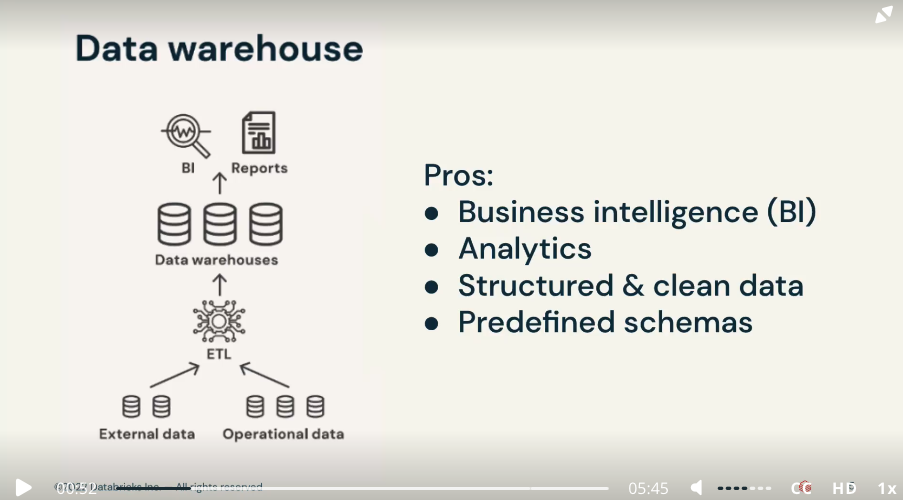

# Fundamentals of the Databricks Lakehouse Platform (V2)

- What is a data lakehouse
    
    Data warehouse
    
    
    
    Not designed with semi structured or unstructured data in mind
    
    Then comes **Data Lakes**
    
    
    
    Issues with data lakes
    
    
    
    Therefore it was required to keep both, stuck in silos
    
    
    
    To fix these problems new data architecture emerged - data lakehouse - single flexible high performant system
    
    
    
    provide benefits of both. Built on a data lake, single source of truth for ai and bi together2
    
    Key features of data lakehouse
    
    
    
- What is databricks Lakehouse Platform
    
    Databricks inventor and pioneer of data lakehouse architecture
    
    
    
    
    
    
    
- Data reliability and performance
    
    **Why Data reliability and performance is important**
    
    bad data in = bad data out
    
    data lake are good to hold large qualities of raw data, but lack reliability and quality features, and end up becoming data swamps
    
    don’t often offer performance as data warehouse
    
    **Issues with data lakes**
    
    Lack of ACID transactions
    
    Lack of schema enforcement
    
    lack of integration with data catalog
    
    data is in immutable format, therefore leads to ineffective partitioning, too many small files
    
    does not have transactional support, appending new data is actually adding new files
    
    small root file leads to query performance degredation
    
    **How Lakehouse solve these issues**
    
    Lakehouse platform solve these issues with the following technologies
    
    - Delta Lake
    - Photon
    
    
    
    - Data lake runs on top of data lake and compatible with spark
    - Delta Lake uses delta tables which are based on Apache Parquet
    - Delta Lake works on Semi-Structured and Unstructured Data
    - Transaction Log - order of record of every transaction, accommodate multi user environment
        
        
        
    - Photon: Execution engine has same performance as data warehouse
    - Photon is the next generation query engine
        
        
        
        
        
- Unified governance and security
    
    
    
    - **Unity Catalog:**
        - Unified governance Solution, for data and models
        - Provides consistent model to discover, access and share data
        
        
        
        - Attribute based access control
        - Remove data silos
        - Unity catalog provides automated data lineage charts
        
        
        
    - **Delta Sharing-**
        - Open source solution to share live data from your lakehouse, to any computing platform securely
        - Recepients don’t even have to be on the same cloud or on data lakehouse platform
        - Open cross platform sharing tool
        - provides native integration with powerbi, tableau, pandas etc
        - data is shared live
        - centralized administration and governance
        
        
        
        - Unity Catalog natively supports delta sharing
            
            
            
        - Delta sharing uses rest protocol
        - Control Plane and Data Plane
        
        
        
        - Security 3 levels
        
        
        
        - User Identity and access
        
        
        
        - Data encrypted at rest or in motion
        
        
        
        - Compliance
            - SOC 2 Type II
            - ISO 27001
            - ISO 27017
            - ISO 27018
            - FEDRAMP High
            - HITRUST
            - HiPAA
            - PCI
            - GDPR, CCPA Ready
        
- Instant compute and serverless
    
    Classic data plane
    
    
    
    Issue with classic data plane - creating clusters
    
    - Cluster creation is complicated
    - Environment startup is slow
    - Clusters hosted in business cloud account, there are limitation on capacity
    - Clusters left running longer
    - Overprovisioning resource
    
    Databricks has released serverless compute option
    
    
    
    - Serverless computer runs on databricks coloud account, completely managed by databricks, total cost of ownership is reduced, 30 to 40 %
    
    
    
- Introduction to lakehouse data management terminology
    - Understand definitions of common lakehouse terms
        - Metastore
        - catalog
        - schema
        - table
        - view
        - function
    
    Dalta Lake: key architectural component provides a data storage format
    
    
    
    
    
    - How data management works in databricks
    
    
    
    - Metastore: top level logical container, construct that represents metadata,  helps with auditing capabilities
    - Catalog: top most container of data objects, metastore can have multiple catalog
    - Three level namespace to access tables in unity catalaog
    
    
    
    - Catalogs can contain as many schemas as desired
    - There are tables, views and functions
    - Table has two things - metadata, and actual data
    - Two types of tables: Managed, External. Metadata
    - Metastore: larger construct of organizing data and its metadata, reference for collection of metadata
- Supported workloads: Data Warehousing
    
    how it supports warehousing workloads using databricks sql
    
    benefits of warehousing with lakehouse platform 
    
    
    
    SQL Analytics: BI Tasks, SQL Transformation, querying, ingesting, building dashboards, delivering insights - uses databricks SQL and serverless SQL behind the scenes
    
    Key Benefits for using databricks lakehouse
    
    
    
- Supported workloads: Data Engineering
    
    Why data quality is so important
    
    How data lakehouse support data engineerint
    
    Delta Live Tables
    
    Data is a valuable assets to a business
    
    Challenges for de workloads
    
    - Complex ingestion method
    - Support de principals - CI CD, Agile, Version control
    - Third party orchestration system
    - pipeline and architecture performance tuning
    - Inconsistencies between warehouse and lakes providers
    
    Lakehouse Makes DE simple
    
    
    
    Lakehouse give de end to end sol for ingestion, transformation, processing, scheduling and delivery of data
    
    Key capabilieits
    
    - Easy data ingestion
    - Automated ETL pipelines
    - Data Quality checks
    - Batch and streaming
    - Automatic recovery
    - data pipeline observability
    - Simplified operation
    - Scheduling and orchestration
    
    
    
    Data Transfomration using medallion architecture - bronze silver gold
    
    DLT- Delta Live Tables
    
    
    
    ETL framework which is declarative approach to build reliable data pipelines, removing overhead from data engineers in terms of infrastructure management and tooling
    
    DLT autoscales
    
    DLT supports both python and sql
    
    Tailored to work with both streaming and batch workloads
    
    DLT supports both batch and streaming workflows
    
    **Databricks workflows**: fully managed orchestration service
    
    Allows you to orchestrate pipelines written in DLT or DBT
    
    you can use external orchestrator such as airflow 
    
    
    
    with databricks workflows
    
- Supported workloads: Data Streaming
    
    
    
    
    
    
    
    
    
- Supported workloads: Data Science and ML
    
    Challenges to DS workflows
    
    
    
    
    
    
    
    
    
    MLFlow and Automl