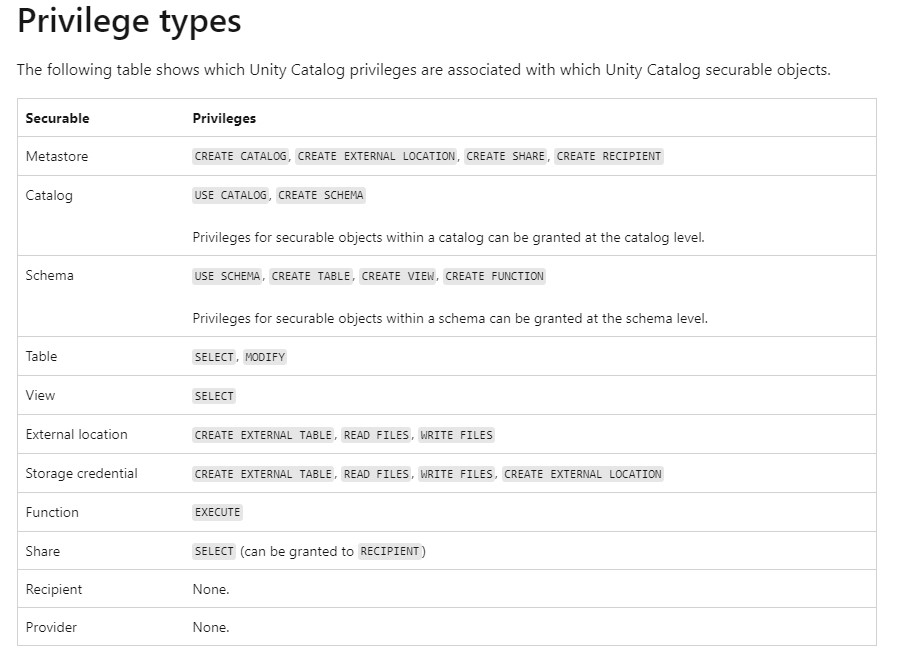

# Udemy Practice Exam 1

- Calculated column delat lake - generated columns?
    - CREATE GENERATED COLUMNS ON DELTA LAKE
    - **Note: Databricks also supports partitioning using generated column**
    
    ```sql
    CREATE TABLE orders (
    	orderId int,
    	orderTime timestamp,
    	orderDate date GENERATED ALWAYS AS(CAST(orderTime AS DATE))
    )
    ```
    
- spot instances
- Autoloader and schema evolution: **Auto loader does not support schema evolution**
- **Auto loader supports both directory listing and file notification but COPY INTO only supports directory listing.**
- **Auto Loader vs COPY INTO?**
- Do we need schema in auto loader: Schema location is used to store inferred schema by auto loader
- Which of the following locations in Databricks product architecture hosts jobs/pipelines and queries?: Control Pane, not Web application
- What type of table is created when you create delta table with below command?
    
    `CREATE TABLE transactions USING DELTA LOCATION "DBFS:/mnt/bronze/transactions"`
    
    - External table is created using DELTA LOCATIOn
    
    ```sql
    Format==
    
    CREATE TABLE table_name ( column column_data_type…) USING format LOCATION "dbfs:/"
    
    format -> DELTA, JSON, CSV, PARQUET, TEXT
    This will create unmanaged external
    
    This will create managed
    CREATE TABLE transactions USING DELTA
    
    ```
    
- DROP managed delta table and underlying files: `DROP TABLE table_name`
- INSERT OVERWRITE: Keeps history of data and you can time travel
- assert statements, how to write
- Which of the following two options are supported in identifying the arrival of new files, and incremental data from Cloud object storage using Auto Loader?:
    - Directory Listing and File Notification
- What are the different ways you can schedule a job in Databricks workspace?
    - Cron, OnDemand Runs
- SQL Endpoint: Databricks recently renamed SQL endpoint to SQL warehouse
- Scaling of SQL endpoint
    - **if the queries are running sequentially then scale up(Size of the cluster from 2X-Small to 4X-Large)**
    - **if the queries are running concurrently or with more users then scale out(add more clusters).**
    - 1. No of worker nodes in a cluster is determined by the size of the cluster (2X -Small ->1 worker, X-Small ->2 workers.... up to 4X-Large -> 128 workers) this is called **Scale up**
    2.
    - 1. A single cluster irrespective of cluster size(2X-Smal.. to ...4XLarge) can only run 10 queries at any given time if a user submits 20 queries all at once to a warehouse with 3X-Large cluster size and cluster scaling (min 1, max1) while 10 queries will start running the remaining 10 queries wait in a queue for these 10 to finish.
    2.
    - Increasing the Warehouse cluster size can improve the performance of a query,
    - if a query runs for 1 minute in a 2X-Small warehouse size it may run in 30 Seconds if we change the warehouse size to X-Small.
    - warehouse can have more than one cluster this is called **Scale out**
    . If a warehouse is configured with X-Small cluster size with cluster scaling(Min1, Max 2) Databricks spins up an additional cluster i
    - **Scale-out** -> to add more clusters for a SQL endpoint, change max number of clusters
    - If you are trying to improve the throughput, being able to run as many queries as possible then having an additional cluster(s) will improve the performance.
    - Databricks SQL automatically scales as soon as it detects queries are in queuing state, in this example scaling is set for min 1 and max 3 which means the warehouse can add three clusters if it detects queries are waiting.
    - Privilege type
    
    
    
- The answer is ALTER TABLE table_name OWNER to ‘group’ instead of GRANT we use ALTER to assigned OWNER to group
-